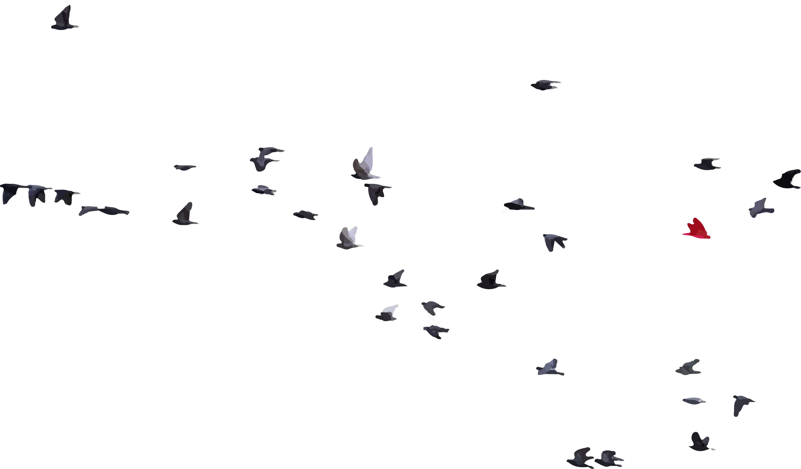

# factlens.dev

Source for [factlens.dev](https://factlens.dev) — the research site for geometric LLM grounding verification.

factlens detects hallucinations using embedding geometry. No second LLM. Deterministic. Auditable.

## What's here

- Research blog on hallucination detection, EU AI Act compliance, and mechanistic interpretability
- Project pages for the [factlens library](https://github.com/factlens/factlens) and [hallucination benchmark](https://github.com/factlens/hallucination-benchmark)
- Documentation at [docs.factlens.dev](https://docs.factlens.dev)

## Research

Three papers on arXiv:

1. **Semantic Grounding Index** (arXiv:2512.13771) — ratio-based grounding verification for RAG systems
2. **A Geometric Taxonomy of Hallucinations** (arXiv:2602.13224) — three-type classification with confabulation benchmark
3. **Rotational Dynamics of Factual Constraint Processing** (arXiv:2603.13259) — transformers reject wrong answers via rotation, not rescaling

## Built with

[Spectre](https://github.com/louisescher/spectre) — a terminal-inspired Astro theme. Deployed on GitHub Pages.

## License

Site content © 2025–2026 Javier Marin. The factlens library is [MIT licensed](https://github.com/factlens/factlens/blob/main/LICENSE). The hallucination benchmark is [CC BY 4.0](https://github.com/factlens/hallucination-benchmark/blob/main/LICENSE).
